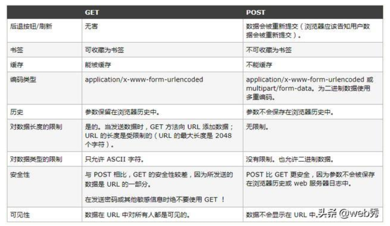

# HTTP

* [RESTful](#RESTful)

* [GET和POST的区别](#GET和POST的区别)

* [Accept和Content-Type](#Accept和Content-Type)

* [状态码](#状态码)

* [HTTP缓存](#HTTP缓存)

* [如何处理不让别人盗用你的图片，访问你的服务器资源](#如何处理不让别人盗用你的图片访问你的服务器资源)

* [Http与Https的区别](#Http与Https的区别)

* [什么是Http协议无状态协议?怎么解决Http协议无状态协议?](#什么是Http协议无状态协议怎么解决Http协议无状态协议)

* [常用的HTTP方法有哪些](#常用的HTTP方法有哪些)

* [一次完整的HTTP请求所经历的7个步骤](#一次完整的HTTP请求所经历的7个步骤)

## [HTTP面试题都在这里](https://zhuanlan.zhihu.com/p/33778904)


## RESTful
REST 指的是一组架构约束条件和原则。满足这些约束条件和原则的应用程序或设计就是 RESTful。

如何编写符合rest架构风格的restful?

1.URL中不可出现动词

2.URL能够唯一地标识单个或一类资源

3.通过Http动词去操作URL标识的资源(get(获取),pst(添加),put(更新),delete(删除))


* GET<br>
get方法在Rest中主要用于获取资源，能够发送参数，不过有限制，且参数都会以?开头的形 式附加在URL尾部。
规范的get方法处理器应该是幂等的，也就是说对一个资源不论发送多少次get请求都不会更改数据或造成破坏。
* POST<br>
post方法在Rest请求中主要用于添加资源，参数信息存放在请求报文的消息体中相对安全，且可发送较大信息
* PUT<br>
put方法在Rest中主要用于更新资源，因为大多数浏览器不支持put和delete，会自动将put和delete请求转化为get和post. 因此为了使用put和delete方法,
需要以post发送请求，在表单中使用隐藏域发送真正的请求。
put方法的参数是同post一样是存放在消息中的，同样具有安全性，可发送较大信息。
put方法是幂等的，对同一URL资源做出的同一数据的任意次put请求其对数据的改变都是一致的。
* DELETE<br>
Delete在Rest请求中主要用于删除资源，因为大多数浏览器不支持put和delete，会自动将put和delete请求转化为get和post。
因此为了使用put和delete方法,需要以post发送请求，在表单中使用隐藏域发送真正的请求。
Delete方法的参数同post一样存放在消息体中,具有安全性，可发送较大信息 Delete方法是幂等的，不论对同一个资源进行多少次delete请求都不会破坏数据

https://blog.csdn.net/jnshu_it/article/details/80203696

## GET和POST的区别

1.back 2.bookmark 3.cache 4.历史记录 5.相对安全(url可见)

6.数据类型ascii 7.编码类型(url/多种) 8.url/request body 9.长度限制 

10.GET产生一个TCP数据包,POST产生两个TCP数据包。

11.本质上都是TCP链接

> 在我大万维网世界中，还有另一个重要的角色：运输公司。不同的浏览器（发起http请求）和服务器（接受http请求）就是不同的运输公司。 虽然理论上，你可以在车顶上无限的堆货物（url中无限加参数）。但是运输公司可不傻，装货和卸货也是有很大成本的，他们会限制单次运输量来控制风险，数据量太大对浏览器和服务器都是很大负担。业界不成文的规定是，（大多数）浏览器通常都会限制url长度在2K个字节，而（大多数）服务器最多处理64K大小的url。超过的部分，恕不处理。如果你用GET服务，在request body偷偷藏了数据，不同服务器的处理方式也是不同的，有些服务器会帮你卸货，读出数据，有些服务器直接忽略，所以，虽然GET可以带request body，也不能保证一定能被接收到哦。
>
>  
>
> 好了，现在你知道，GET和POST本质上就是TCP链接，并无差别。但是由于HTTP的规定和浏览器/服务器的限制，导致他们在应用过程中体现出一些不同。 
>

**GET产生一个TCP数据包；POST产生两个TCP数据包。**

> 长的说：
>
> 对于GET方式的请求，浏览器会把http header和data一并发送出去，服务器响应200（返回数据）；
>
> 而对于POST，浏览器先发送header，服务器响应100 continue，浏览器再发送data，服务器响应200 ok（返回数据）。
>
>  
>
> 也就是说，GET只需要汽车跑一趟就把货送到了，而POST得跑两趟，第一趟，先去和服务器打个招呼“嗨，我等下要送一批货来，你们打开门迎接我”，然后再回头把货送过去。
>
>  
>
> 因为POST需要两步，时间上消耗的要多一点，看起来GET比POST更有效。因此Yahoo团队有推荐用GET替换POST来优化网站性能。但这是一个坑！跳入需谨慎。为什么？
>
> \1. GET与POST都有自己的语义，不能随便混用。
>
> \2. 据研究，在网络环境好的情况下，发一次包的时间和发两次包的时间差别基本可以无视。而在网络环境差的情况下，两次包的TCP在验证数据包完整性上，有非常大的优点。
>
> \3. 并不是所有浏览器都会在POST中发送两次包，Firefox就只发送一次。



https://www.cnblogs.com/logsharing/p/8448446.html

https://www.cnblogs.com/williamjie/p/9099940.html

https://baijiahao.baidu.com/s?id=1626599028653203490&wfr=spider&for=pc

* GET产生一个TCP数据包；POST产生两个TCP数据包。
* GET在浏览器回退时是无害的，而POST会再次提交请求。
* GET产生的URL地址可以被Bookmark，而POST不可以。
* GET请求会被浏览器主动cache，而POST不会，除非手动设置。
* GET请求只能进行url编码，而POST支持多种编码方式。
* GET请求参数会被完整保留在浏览器历史记录里，而POST中的参数不会被保留。
* GET请求在URL中传送的参数是有长度限制的，而POST么有。
* 对参数的数据类型，GET只接受ASCII字符，而POST没有限制。
* GET比POST更不安全，因为参数直接暴露在URL上，所以不能用来传递敏感信息。
* GET参数通过URL传递，POST放在Request body中。


## Accept和Content-Type
Accept 请求头用来告知客户端可以处理的内容类型，这种内容类型用MIME类型来表示。
服务器使用 Content-Type 应答头通知客户端它的选择。
```
Accept: text/html
Accept: image/*
Accept: text/html, application/xhtml+xml, application/xml;q=0.9, */*;q=0.8
```
1.Accept属于请求头， Content-Type属于实体头。 <br>
Http报头分为通用报头，请求报头，响应报头和实体报头。 <br>
请求方的http报头结构：通用报头|请求报头|实体报头 <br>
响应方的http报头结构：通用报头|响应报头|实体报头<br>

2.Accept代表发送端（客户端）希望接受的数据类型。 <br>
比如：Accept：text/xml; <br>
代表客户端希望接受的数据类型是xml类型<br>

Content-Type代表发送端（客户端|服务器）发送的实体数据的数据类型。 <br>
比如：Content-Type：text/html; <br>
代表发送端发送的数据格式是html。<br>

二者合起来， <br>
Accept:text/xml； <br>
Content-Type:text/html <br>
即代表希望接受的数据类型是xml格式，本次请求发送的数据的数据格式是html。<br>

## 状态码

[常见状态码](https://blog.csdn.net/suntao19951010/article/details/82387247)

| 状态码 | 类别 | 描述 |
| -- | -- | -- |
| 1xx | Informational（信息状态码） | 接受请求正在处理 |
| 2xx | Success（成功状态码） | 请求正常处理完毕 |
| 3xx | Redirection（重定向状态码） | 需要附加操作已完成请求 |
| 4xx | Client Error（客户端错误状态码） | 服务器无法处理请求 |
| 5xx | Server Error（服务器错误状态码） | 服务器处理请求出错 |

[回到顶部](#HTTP)

## HTTP缓存
https://segmentfault.com/a/1190000010690320

## 如何处理不让别人盗用你的图片，访问你的服务器资源
* http header, 对refer做判断看来源是不是自己的网站，如果不是就拒绝
* 通过session校验，如果不通过特定服务生成cookie和session就不能请求得到资源

[回到顶部](#HTTP)

## Http与Https的区别

[SSL/TLS](https://blog.csdn.net/qq_35642036/article/details/82788421#SSL%2FTLS历史)

* HTTP 的URL 以http:// 开头，而HTTPS 的URL 以https:// 开头
* HTTP 是不安全的，而 HTTPS 是安全的
* HTTP 标准端口是80 ，而 HTTPS 的标准端口是443
* 在OSI 网络模型中，HTTP工作于应用层，而HTTPS 的安全传输机制工作在传输层
* HTTP 无法加密，而HTTPS 对传输的数据进行加密
* HTTP无需证书，而HTTPS 需要CA机构wosign的颁发的SSL证书

https://zhuanlan.zhihu.com/p/33778904

[回到顶部](#HTTP)

## 什么是Http协议无状态协议?怎么解决Http协议无状态协议?
无状态协议对于事务处理没有记忆能力。缺少状态意味着如果后续处理需要前面的信息也就是说，<br>
当客户端一次HTTP请求完成以后，客户端再发送一次HTTP请求，HTTP并不知道当前客户端是一个”老用户“。<br>

可以使用Cookie来解决无状态的问题，Cookie就相当于一个通行证，第一次访问的时候给客户端发送一个Cookie，<br>
当客户端再次来的时候，拿着Cookie(通行证)，那么服务器就知道这个是”老用户“。<br>

https://zhuanlan.zhihu.com/p/33778904

[回到顶部](#HTTP)

## 常用的HTTP方法有哪些
* GET：用于请求访问已经被URL（统一资源定位符）识别的资源，可以通过URL传参给服务器。
* POST：用于传输信息给服务器，主要功能与Get方法类似，但一般推荐POST方式。
* PUT：传输文件，报文主体包含文件内容，保存到对应URL位置。
* HEAD：获取报文首部，与GET方法类似，只是不返回报文主体，一般用于验证URL是否有效。
* DELET：删除文件，与PUT方法相反，删除对应URL位置的文件。OPTIONS：查询相应URL支持的HTTP方法。

[回到顶部](#HTTP)

## URL和URI

http://developer.51cto.com/art/201709/551926.htm

https://segmentfault.com/a/1190000019487884?utm_source=tag-newest

---------------------

这是一个URI：

http://bitpoetry.io/posts/hello.html#intro

\#intro

是资源。

在我们的例子中，URL应该如下所示：

http://bitpoetry.io/posts/hello.html

URN如下所示：

bitpoetry.io/posts/hello.html#intro

----------------

**URI，是uniform resource identifier，统一资源标识符，用来唯一的标识一个资源。**

- Web上可用的每种资源如HTML文档、图像、视频片段、程序等都是一个来URI来定位的
- URI一般由三部组成：
- ①访问资源的命名机制
- ②存放资源的主机名
- ③资源自身的名称，由路径表示，着重强调于资源。

**URL是uniform resource locator，统一资源定位器，它是一种具体的URI，即URL可以用来标识一个资源，而且还指明了如何locate这个资源。**

- URL是Internet上用来描述信息资源的字符串，主要用在各种WWW客户程序和服务器程序上，特别是著名的Mosaic。
- 采用URL可以用一种统一的格式来描述各种信息资源，包括文件、服务器的地址和目录等。URL一般由三部组成：
- ①协议(或称为服务方式)
- ②存有该资源的主机IP地址(有时也包括端口号)
- ③主机资源的具体地址。如目录和文件名等

**URN，uniform resource name，统一资源命名，是通过名字来标识资源，比如mailto:java-net@java.sun.com。**

- URI是以一种抽象的，高层次概念定义统一资源标识，而URL和URN则是具体的资源标识的方式。URL和URN都是一种URI。笼统地说，每个 URL 都是 URI，但不一定每个 URI 都是 URL。这是因为 URI 还包括一个子类，即统一资源名称 (URN)，它命名资源但不指定如何定位资源。上面的 mailto、news 和 isbn URI 都是 URN 的示例。


## 一次完整的HTTP请求所经历的7个步骤
HTTP通信机制是在一次完整的HTTP通信过程中，Web浏览器与Web服务器之间将完成下列7个步骤：

* 建立TCP连接

在HTTP工作开始之前，Web浏览器首先要通过网络与Web服务器建立连接，该连接是通过TCP来完成的，该协议与IP协议共同构建 Internet，即著名的TCP/IP协议族，因此Internet又被称作是TCP/IP网络。HTTP是比TCP更高层次的应用层协议，根据规则， 只有低层协议建立之后才能，才能进行更层协议的连接，因此，首先要建立TCP连接，一般TCP连接的端口号是80。

* Web浏览器向Web服务器发送请求行

一旦建立了TCP连接，Web浏览器就会向Web服务器发送请求命令。例如：GET /sample/hello.jsp HTTP/1.1。


* Web浏览器发送请求头

浏览器发送其请求命令之后，还要以头信息的形式向Web服务器发送一些别的信息，之后浏览器发送了一空白行来通知服务器，它已经结束了该头信息的发送。


* Web服务器应答

客户机向服务器发出请求后，服务器会客户机回送应答， HTTP/1.1 200 OK ，应答的第一部分是协议的版本号和应答状态码。


* Web服务器发送应答头

正如客户端会随同请求发送关于自身的信息一样，服务器也会随同应答向用户发送关于它自己的数据及被请求的文档。


* Web服务器向浏览器发送数据

Web服务器向浏览器发送头信息后，它会发送一个空白行来表示头信息的发送到此为结束，接着，它就以Content-Type应答头信息所描述的格式发送用户所请求的实际数据。


* Web服务器关闭TCP连接

一般情况下，一旦Web服务器向浏览器发送了请求数据，它就要关闭TCP连接，然后如果浏览器或者服务器在其头信息加入了这行代码：


```
Connection:keep-alive
```
TCP连接在发送后将仍然保持打开状态，于是，浏览器可以继续通过相同的连接发送请求。保持连接节省了为每个请求建立新连接所需的时间，还节约了网络带宽。

建立TCP连接->发送请求行->发送请求头->（到达服务器）发送状态行->发送响应头->发送响应数据->断TCP连接


https://juejin.im/post/5a8102e0f265da4e710f5910

[回到顶部](#HTTP)

