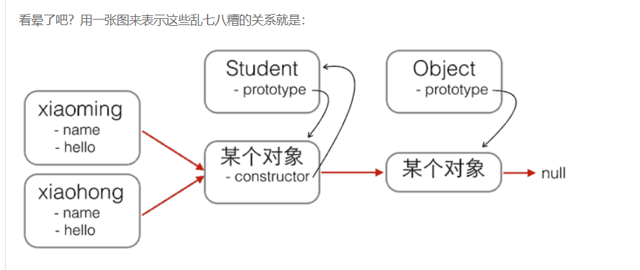
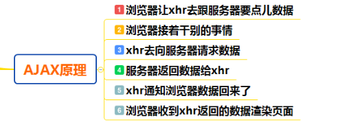

## 原型

如果想要使用一些属性和方法,并且属性的值在每个对象中都是一样的,方法在每个对象中的操作也都是一样,那么,为了**共享数据,节省内存空间**,是可以把属性和方法通过原型的方式进行赋值

## 原型链

是一种关系**,实例对象**和**原型对象**之间的关系,关系是通过原型(`__proto__`)来联系的

(

当试图得到一个对象f的某个属性时，如果这个对象本身没有这个属性，那么会去它的_proto_（即它的构造函数的prototype）obj._proto_中去寻找.....

)

用`new Student()`创建的对象还从原型上获得了一个`constructor`属性，它指向函数`Student`本身：

```js
xiaoming.constructor === Student.prototype.constructor; // true
Student.prototype.constructor === Student; // true

Object.getPrototypeOf(xiaoming) === Student.prototype; // true

xiaoming instanceof Student; // true
```




```js
  <script>
    //使用对象---->使用对象中的属性和对象中的方法,使用对象就要先有构造函数
    //构造函数
    function Person(name,age) {
      //属性
      this.name=name;
      this.age=age;
      //在构造函数中的方法
      this.eat=function () {
        console.log("吃好吃的");
      };
    }
    //添加共享的属性
    Person.prototype.sex="男";
    //添加共享的方法
    Person.prototype.sayHi=function () {
      console.log("您好啊,怎么这么帅,就是这么帅");
    };
    //实例化对象,并初始化
    var per=new Person("小明",20);
    per.sayHi();
    //如果想要使用一些属性和方法,并且属性的值在每个对象中都是一样的,方法在每个对象中的操作也都是一样,那么,为了共享数据,节省内存空间,是可以把属性和方法通过原型的方式进行赋值

    console.dir(per);//实例对象的结构
    console.dir(Person);//构造函数的结构

    //实例对象的原型__proto__和构造函数的原型prototype指向是相同的

    //实例对象中的__proto__原型指向的是构造函数中的原型prototype
    console.log(per.__proto__==Person.prototype);
    //实例对象中__proto__是原型,浏览器使用的
    //构造函数中的prototype是原型,程序员使用的

    //原型链:是一种关系,实例对象和原型对象之间的关系,关系是通过原型(__proto__)来联系的


  </script>
```

## 原型继承 //组合继承 // class继承

在传统的基于Class的语言如Java、C++中，继承的本质是扩展一个已有的Class，并生成新的Subclass
在js中,我们无法直接扩展一个Class

JavaScript的原型继承实现方式就是：
(改变原型的指向)
定义新的构造函数，并在内部用call()调用希望“继承”的构造函数，并绑定this；

借助中间函数F实现原型链继承，最好通过封装的inherits函数完成；

继续在新的构造函数的原型上定义新方法。

## 原型继承和new/Object.create()

[阮一峰](https://www.liaoxuefeng.com/wiki/1022910821149312/1023022126220448)

[**Object.create()**](https://developer.mozilla.org/zh-CN/docs/Web/JavaScript/Reference/Global_Objects/Object/create)

polyfill

```js
Object.create = function (proto) {
        function F() {}
        F.prototype = proto;
        return new F();
    };
```


**Object.create(proto)**方法创建一个新对象，使用现有的对象来提供新创建的对象的__proto__。 （请打开浏览器控制台以查看运行结果。）

`proto`新创建对象的原型对象

```js
// Shape - 父类(superclass)
function Shape() {
  this.x = 0;
  this.y = 0;
}

// 父类的方法
Shape.prototype.move = function(x, y) {
  this.x += x;
  this.y += y;
  console.info('Shape moved.');
};

// Rectangle - 子类(subclass)
function Rectangle() {
  Shape.call(this); // call super constructor.
}

// 子类续承父类
Rectangle.prototype = Object.create(Shape.prototype);
Rectangle.prototype.constructor = Rectangle;

var rect = new Rectangle();

console.log('Is rect an instance of Rectangle?',
  rect instanceof Rectangle); // true
console.log('Is rect an instance of Shape?',
  rect instanceof Shape); // true
rect.move(1, 1); // Outputs, 'Shape moved.'


```

原型继承:廖雪峰

```js
function inherits(Child, Parent) {
    var F = function () {};
    F.prototype = Parent.prototype;
    Child.prototype = new F();
    Child.prototype.constructor = Child;
    // 相当于
    Child.prototype = Object.create(Parent.prototype)
    Child.prototype.constructor = Child
}
// 以下是MDN的代码
PrimaryStudent.prototype = Object.create(Student.prototype)
// 把PrimaryStudent原型的构造函数修复为PrimaryStudent:
PrimaryStudent.prototype.constructor = PrimaryStudent;
// 相当于 

// 把F的原型指向Student.prototype:
F.prototype = Student.prototype;
// 把PrimaryStudent的原型指向一个新的F对象，F对象的原型正好指向Student.prototype:
PrimaryStudent.prototype = new F();
```

### new操作符原理

```js
//new运算符原理实现
var new1 = function(fun){
    var newObj = Object.create(fun.prototype);
    // obj.__proto__=Foo.prototype;
    // obj.__proto__.constructor=Foo;
    var returnObj = fun.call(newObj);
    if(typeof returnObj === 'object'){
        return returnObj
    }else{
        return newObj
    }
}
```


## 冒泡

```js
let arr = [2,1,5,6,3]

function sortArr(arr) {
  for(let i=0; i<arr.length-1; i++) {
    let flag = true
    for(let j=i; j< arr.length-1-i;j++) {
      if(arr[j]>arr[j+1]) {
        let temp = arr[j]
        arr[j] = arr[j+1]
        arr[j+1] = temp
        flag = false
      }
    }
    if(flag) {
      break
    }
  }
}
sortArr(arr)
console.log(arr);

```


## promise ajax

[Ajax原理一篇就够了](http://www.sohu.com/a/238246281_100109711)

[Ajax原理](https://blog.csdn.net/weixin_37580235/article/details/81459282#1.3%20Ajax的工作原理)

**原理**: 老板 - 秘书 - 小李 的关系, 浏览器 - 中间层(Ajax引擎) - 服务器



**作用**: 提高用户体验, 较少的网络数据传输量

核心对象: XMLHttpRequest

```js
function ajax({ method, path, body, headers}) {
  return new Promise((resolve, reject) => {
    let xhr = new XMLHttpRequest()
    xhr.open(method, path)
    for (let key in headers) {
      let value = headers[key]
      xhr.setRequestHeader(key, value)
    }
    xhr.send(body)
    xhr.onreadystatechange = () => {
      if(xhr.readyState === 4) {
        if(xhr.status >= 200 &&xhr.status <= 400) {
          resolve(xhr.responseText)
        } else {
          reject(xhr)
        }
      }
    }
  })
}

ajax({
  method: 'post',
  path: '/xx',
  body: 'username=root&password=123456',
  header: {
    'content-type': 'application/x-www-form-urlencoded',
    'Authorization': 'token'
  }
})
  .then(response => {
    
  })

```


## 闭包

[闭包是什么](https://bbs.csdn.net/topics/392430917?page=1)

### 闭包是什么?

在函数里面return 一个函数;

### 作用

闭包主要是避免全局变量带来的污染,保护局部变量不被回收,对象内部封装一个私有变量(返回的函数会被缓存,一直在内存当中)

案例

点赞

[防抖函数 ](https://blog.csdn.net/l598465252/article/details/85797497)

```js
function debounce (func, delay) {
  let timer;
  let lock = false;
  return function (params) {
    if (lock) {
      // 触发间隔未结束，重新设定计时器
      clearTimeout(timer);
      timer = setTimeout(() => {
        lock = false;
        clearTimeout(timer);
        timer = null;
      }, delay);
    } else {
      lock = true;
      func(params);
    }
  };
}

```

携带状态的函数/

了解闭包先了解js的变量：全局/局部

全局变量可以在任何地方获取

局部变量只能在函数内部获取

闭包的出现，可以获取函数内部的变量且变量一直在内存当中,缓存数据,

在这里稍微看一下js的变量提升

## 深浅拷贝

```js
  <script>
    
    //浅拷贝:拷贝就是复制,就相当于把一个对象中的所有的内容,复制一份给另一个对象,直接复制,或者说,就是把一个对象的地址给了另一个对象,他们指向相同,两个对象之间有共同的属性或者方法,都可以使用
    
    
    var obj1={
      age:10,
      sex:"男",
      car:["奔驰","宝马","特斯拉","奥拓"]
    };
    //另一个对象
    var obj2={};
    
    //写一个函数,作用:把一个对象的属性复制到另一个对象中,浅拷贝
    //把a对象中的所有的属性复制到对象b中
    function extend(a,b) {
      for(var key in a){
        b[key]=a[key];
      }
    }
    extend(obj1,obj2);
    console.dir(obj2);//开始的时候这个对象是空对象
    console.dir(obj1);//有属性

    
    
    
  </script>

  <script>
    //深拷贝:拷贝还是复制,深:把一个对象中所有的属性或者方法,一个一个的找到.并且在另一个对象中开辟相应的空间,一个一个的存储到另一个对象中

    var obj1={
      age:10,
      sex:"男",
      car:["奔驰","宝马","特斯拉","奥拓"],
      dog:{
        name:"大黄",
        age:5,
        color:"黑白色"
      }
    };

    var obj2={};//空对象
    //通过函数实现,把对象a中的所有的数据深拷贝到对象b中
    function extend(a,b) {
      for(var key in a){
        //先获取a对象中每个属性的值
        var item=a[key];
        //判断这个属性的值是不是数组
        if(item instanceof Array){
          //如果是数组,那么在b对象中添加一个新的属性,并且这个属性值也是数组
          b[key]=[];
          //调用这个方法，把a对象中这个数组的属性值一个一个的复制到b对象的这个数组属性中
          extend(item,b[key]);
        }else if(item instanceof Object){//判断这个值是不是对象类型的
     //如果是对象类型的,那么在b对象中添加一个属性,是一个空对象
          b[key]={};
          //再次调用这个函数,把a对象中的属性对象的值一个一个的复制到b对象的这个属性对象中
          extend(item,b[key]);
        }else{
          //如果值是普通的数据,直接复制到b对象的这个属性中
          b[key]=item;
        }
      }
    }

    extend(obj1,obj2);
    console.dir(obj1);
    console.dir(obj2);


// 注意:
/*
深拷贝的另外一种方法就是利用JSON.stringfy和parse


*/


  </script>
```

## ES6交换两个值

```js
[a,b]=[b,a];

a=[b,b=a][0];
```

## [HTML5和CSS3新特性一览](https://www.cnblogs.com/star91/p/5659134.html)

HTML5
1.新元素,包括input 类型,新的语义标签
2.Canvas,
3.新增API(拖放,地理位置,Audio,Video)
4.Web存储
( 

sessionStorage,localStorage,cookies的区别 

不同网站相互之间不能访问,同源策略(安全)

)
5.应用程序缓存
6.WebSocket

CSS3
1.新增一些伪类选择器
2.animation(@keyframes),tramsform
3.背景渐变
4.flex

## MVC和MVVM

MVC: Controller被设计出来并不是处理数据解析的。1、管理自己的生命周期；2、处理Controller之间的跳转；3、实现Controller容器。这里面根本没有“数据解析”这一项

MVVM: 想象Controller是一个Boss，数据是一堆文件（Model），如果现在是MVC，那么数据解析（比如整理文件）需要由Boss亲自完成，然而实际上Boss需要的仅仅是整理好的文件而不是那一堆乱七八糟的整理前的文件。所以Boss招聘了一个秘书，现在Boss就不再需要管理原始数据（整理之前的文件）了，他只需要去找秘书：你帮我把文件整理好后给我。
作者：星球小霸王链接：https://www.jianshu.com/p/b0aab1ffad93来源：简书简书著作权归作者所有，任何形式的转载都请联系作者获得授权并注明出处。

## [Vue中的身份验证](https://www.cnblogs.com/jtjds/p/9634840.html)

登陆权限: 登陆token,vuex store中存储token,(在axios的拦截器中带上请求头)

通过路由全局前置守卫判断是否带有已经登陆(带有token),axios拦截器判断是否过期


可访问路由权限(动态加载菜单和路由): 在页面加载的时候，就进行权限判断(路由meta属性)路由元信息增加角色,没有就都允许)，有的话通过router.addRoutes方法挂载在可访问路由表上,无权限的操作不进行显示

## VUEX

Vuex 使用**单一状态树**,管理状态的仓库

mutations必须是同步的, 我们都知道任何回调函数中进行的状态改变都是无法追踪的,无法实现捕捉状态devtools
Action 提交的是 mutation，而不是直接变更状态,为了解决mutations只有同步的问题


## 双向数据绑定

## 正则

## VUE query和params区别

```
params 和 query 传参的区别：
1、params传参时  参数不会出现在url的路径上面， 但是刷新页面时param里面的数据会消失
2、query传参时   参数出现在url的路径上面， 刷新页面时query里面的数据不变
```

**如果想要在页面刷新或者执行其它操作之后还保留传递的参数，需要在路由表（routes）中作配置，使用 “：参数名”的形式进行占位处理**


## cookies/session/token

https://www.cnblogs.com/moyand/p/9047978.html

https://segmentfault.com/a/1190000017831088

https://www.cnblogs.com/pengc/p/8714475.html

## cookies/sessionStroage/localStroage