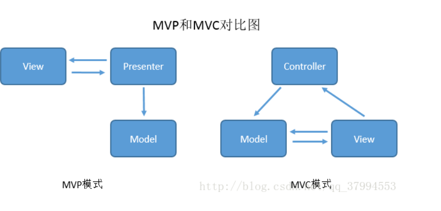
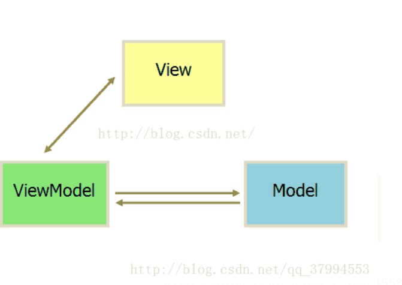
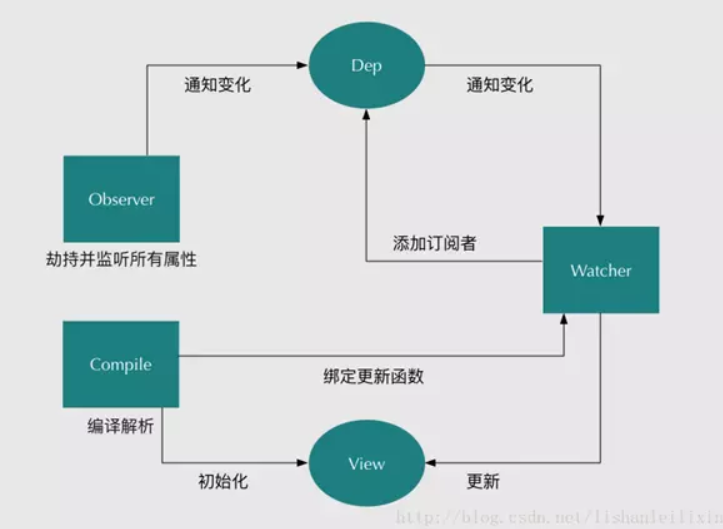
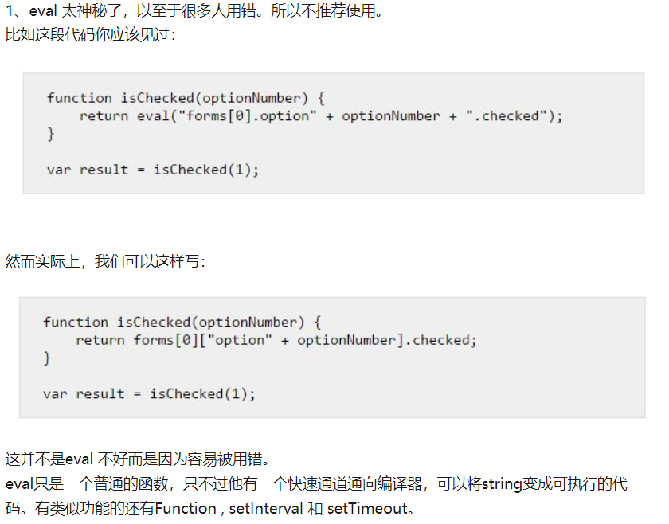
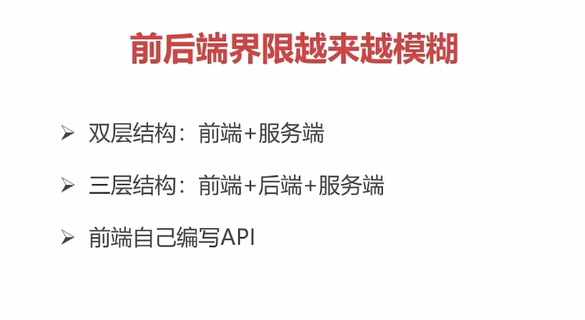
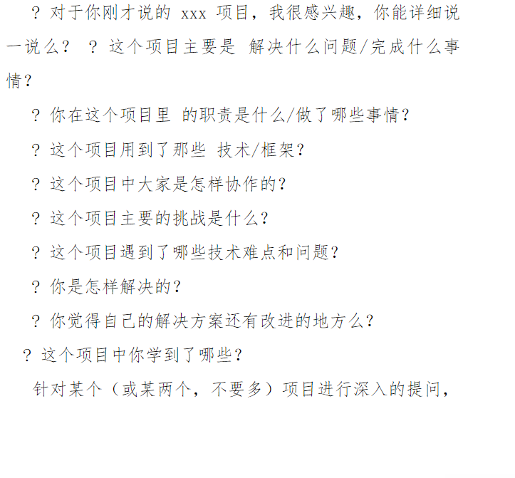

## 堆栈和数据类型

（1）值类型（基本类型）：字符串（string）、数值（number）、布尔值（boolean）、undefined、null  （这5种基本数据类型是按值访问的，因为可以操作保存在变量中的实际的值）(ECMAScript 2016新增了一种基本数据类型：symbol http://es6.ruanyifeng.com/#docs/symbol )

（2）引用类型：对象（Object）、数组（Array）、函数（Function）

基本类型的数据是存放在**栈**内存中的，而引用类型的数据是存放在堆内存中的


基本类型的复制就是在栈内存中开辟出了一个新的存储区域用来存储新的变量，这个变量有它自己的值，只不过和前面的值一样，所以如果其中一个的值改变，则不会影响到另一个

https://www.cnblogs.com/leiting/p/8081413.html

https://www.cnblogs.com/yikezhuixun/p/6126136.html

https://www.cnblogs.com/ljuyi/p/6100071.html

## 原型

https://juejin.im/post/58f94c9bb123db411953691b

如果想要使用一些属性和方法,并且属性的值在每个对象中都是一样的,方法在每个对象中的操作也都是一样,那么,为了**共享数据,节省内存空间**,是可以把属性和方法通过原型的方式进行赋值

## 原型链

是一种关系**,实例对象**和**原型对象**之间的关系,关系是通过原型(`__proto__`)来联系的

(

当试图得到一个对象f的某个属性时，如果这个对象本身没有这个属性，那么会去它的_proto_（即它的构造函数的prototype）obj._proto_中去寻找.....

)

**new ()**

用`new Student()`创建的对象还从原型上获得了一个`constructor`属性，它指向函数`Student`本身：

```js
xiaoming.constructor === Student.prototype.constructor; // true
Student.prototype.constructor === Student; // true

Object.getPrototypeOf(xiaoming) === Student.prototype; // true

xiaoming instanceof Student; // true
```


```js
  <script>
    //使用对象---->使用对象中的属性和对象中的方法,使用对象就要先有构造函数
    //构造函数
    function Person(name,age) {
      //属性
      this.name=name;
      this.age=age;
      //在构造函数中的方法
      this.eat=function () {
        console.log("吃好吃的");
      };
    }
    //添加共享的属性
    Person.prototype.sex="男";
    //添加共享的方法
    Person.prototype.sayHi=function () {
      console.log("您好啊,怎么这么帅,就是这么帅");
    };
    //实例化对象,并初始化
    var per=new Person("小明",20);
    per.sayHi();
    //如果想要使用一些属性和方法,并且属性的值在每个对象中都是一样的,方法在每个对象中的操作也都是一样,那么,为了共享数据,节省内存空间,是可以把属性和方法通过原型的方式进行赋值

    console.dir(per);//实例对象的结构
    console.dir(Person);//构造函数的结构

    //实例对象的原型__proto__和构造函数的原型prototype指向是相同的

    //实例对象中的__proto__原型指向的是构造函数中的原型prototype
    console.log(per.__proto__==Person.prototype);
    //实例对象中__proto__是原型,浏览器使用的
    //构造函数中的prototype是原型,程序员使用的

    //原型链:是一种关系,实例对象和原型对象之间的关系,关系是通过原型(__proto__)来联系的


  </script>
```

## 原型继承 //组合继承 // class继承

```
function PrimaryStudent(props) {
    // 调用Student构造函数，绑定this变量:
    Student.call(this, props);
    this.grade = props.grade || 1;
}
但是，调用了Student构造函数不等于继承了Student，不能继承父类原型上的方法
```


在传统的基于Class的语言如Java、C++中，继承的本质是扩展一个已有的Class，并生成新的Subclass
在js中,我们无法直接扩展一个Class

JavaScript的原型继承实现方式就是：
(改变原型的指向)
定义新的构造函数，并在内部用call()调用希望“继承”的构造函数，并绑定this；

借助中间函数F实现原型链继承，最好通过封装的inherits函数完成；

继续在新的构造函数的原型上定义新方法。

## 原型继承和new/Object.create()

[阮一峰](https://www.liaoxuefeng.com/wiki/1022910821149312/1023022126220448)

[**Object.create()**](https://developer.mozilla.org/zh-CN/docs/Web/JavaScript/Reference/Global_Objects/Object/create)

polyfill

```js
Object.create = function (proto) {
        function F() {}
        F.prototype = proto;
        return new F();
    };
```


**Object.create(proto)**方法创建一个新对象，使用现有的对象来提供新创建的对象的__proto__。 （请打开浏览器控制台以查看运行结果。）

`proto`新创建对象的原型对象

```js
// Shape - 父类(superclass)
function Shape() {
  this.x = 0;
  this.y = 0;
}

// 父类的方法
Shape.prototype.move = function(x, y) {
  this.x += x;
  this.y += y;
  console.info('Shape moved.');
};

// Rectangle - 子类(subclass)
function Rectangle() {
  Shape.call(this); // call super constructor.
}

// 子类续承父类
Rectangle.prototype = Object.create(Shape.prototype);
Rectangle.prototype.constructor = Rectangle;

var rect = new Rectangle();

console.log('Is rect an instance of Rectangle?',
  rect instanceof Rectangle); // true
console.log('Is rect an instance of Shape?',
  rect instanceof Shape); // true
rect.move(1, 1); // Outputs, 'Shape moved.'


```

原型继承:廖雪峰

```js
function inherits(Child, Parent) {
    var F = function () {};
    F.prototype = Parent.prototype;
    Child.prototype = new F();
    Child.prototype.constructor = Child;
    // 相当于
    Child.prototype = Object.create(Parent.prototype)
    Child.prototype.constructor = Child
}
// 以下是MDN的代码
PrimaryStudent.prototype = Object.create(Student.prototype)
// 把PrimaryStudent原型的构造函数修复为PrimaryStudent:
PrimaryStudent.prototype.constructor = PrimaryStudent;
// 相当于 

// 把F的原型指向Student.prototype:
F.prototype = Student.prototype;
// 把PrimaryStudent的原型指向一个新的F对象，F对象的原型正好指向Student.prototype:
PrimaryStudent.prototype = new F();
```

### new操作符原理

这篇比较好

https://www.cnblogs.com/zhangchs/p/11067664.html

最好这个

https://www.jianshu.com/p/842fed8551c9

```js
// 最佳
function Student(name, age) {
  this.name = name
  this.age = age
}
function _new() {
  var obj = new Object()
  var Con = [].shift.call(arguments)
  obj.__proto__ = Con.prototype
  var ret = Con.apply(obj, arguments)
  return typeof ret === 'object' ? ret : obj
}

let xiaoming = _new(Student,'xiaoming', 15)
console.log(xiaoming);


//new运算符的伪码实现 
function _new(clazz, args){ 
    //clone(clazz.prototype) 
    var this = {}; 
    this.__proto__ = clazz.prototype; 
    var obj  = clazz.apply(this, args); 
    var type = typeof obj; 
    if(type == "object" && obj !== null || type == "function"){ 
        return obj; 
    }else{ 
        return this; 
    } 
    /* 另一种写法
    if(obj === null || type == "undefined" || type == "boolean" || type == "number" || type == "string"){
        return this;
    }else{
        return obj;
    }
    */ 
} 
var a = new ClassA(1,2); 
var a = _new(ClassA, [1,2]);  //伪码  　　<br><br>来源：https://wmingjian.iteye.com/blog/1881658


//new运算符原理实现
var new1 = function(fun){
    var newObj = Object.create(fun.prototype);
    // obj.__proto__=Foo.prototype;
    // obj.__proto__.constructor=Foo;
    var returnObj = fun.call(newObj);
    if(typeof returnObj === 'object'){
        return returnObj
    }else{
        return newObj
    }
}
```


## 冒泡

```js
let arr = [2,1,5,6,3]

function sortArr(arr) {
  for(let i=0; i<arr.length-1; i++) {
    let flag = true
    for(let j=0; j< arr.length-1-i;j++) {
      if(arr[j]>arr[j+1]) {
        let temp = arr[j]
        arr[j] = arr[j+1]
        arr[j+1] = temp
        flag = false
      }
    }
    if(flag) {
      break
    }
  }
}
sortArr(arr)
console.log(arr);

```


## promise ajax

[Ajax原理一篇就够了](http://www.sohu.com/a/238246281_100109711)

[Ajax原理](https://blog.csdn.net/weixin_37580235/article/details/81459282#1.3%20Ajax的工作原理)

**原理**: 老板 - 秘书 - 小李 的关系, 浏览器 - 中间层(Ajax引擎) - 服务器


**作用**: 提高用户体验, 较少的网络数据传输量

核心对象: XMLHttpRequest

```js
function ajax({ method, path, body, headers}) {
  return new Promise((resolve, reject) => {
    let xhr = new XMLHttpRequest()
    xhr.open(method, path)
    for (let key in headers) {
      let value = headers[key]
      xhr.setRequestHeader(key, value)
    }
    xhr.send(body)
    xhr.onreadystatechange = () => {
      if(xhr.readyState === 4) {
        if(xhr.status >= 200 &&xhr.status <= 400) {
          resolve(xhr.responseText)
        } else {
          reject(xhr)
        }
      }
    }
  })
}

ajax({
  method: 'post',
  path: '/xx',
  body: 'username=root&password=123456',
  header: {
    'content-type': 'application/x-www-form-urlencoded',
    'Authorization': 'token'
  }
})
  .then(response => {
    
  })

```


## 闭包

[闭包是什么](https://bbs.csdn.net/topics/392430917?page=1)

https://www.cnblogs.com/Frank-C/p/4964999.html

### 闭包是什么?


在函数里面return 一个函数;

### 作用

闭包主要是避免全局变量带来的污染,保护局部变量不被回收,对象内部封装一个私有变量(返回的函数会被缓存,一直在内存当中)

案例

点赞

数据隐藏

在JAVA中，我们知道他有一个叫数据隐藏的特性：  那么，JavaScript中的闭包，或许为我们敞开了大门:

```js
var db = (function() {
  var data = {}
  return function(key, val) {
    if (val === undefined) { return data[key] }
    else { return data[key] = val }
  }
})()

let a = db('x',1)
console.log(db('x'));

```


[防抖函数 ](https://blog.csdn.net/l598465252/article/details/85797497)

```js
function debounce (func, delay) {
  let timer;
  let lock = false;
  return function (params) {
    if (lock) {
      // 触发间隔未结束，重新设定计时器
      clearTimeout(timer);
      timer = setTimeout(() => {
        lock = false;
        clearTimeout(timer);
        timer = null;
      }, delay);
    } else {
      lock = true;
      func(params);
    }
  };
}

```

携带状态的函数/

了解闭包先了解js的变量：全局/局部

全局变量可以在任何地方获取

局部变量只能在函数内部获取

闭包的出现，可以获取函数内部的变量且变量一直在内存当中,缓存数据,

在这里稍微看一下js的变量提升

## 深浅拷贝

```js
  <script>
    
    //浅拷贝:拷贝就是复制,就相当于把一个对象中的所有的内容,复制一份给另一个对象,直接复制,或者说,就是把一个对象的地址给了另一个对象,他们指向相同,两个对象之间有共同的属性或者方法,都可以使用
    
    
    var obj1={
      age:10,
      sex:"男",
      car:["奔驰","宝马","特斯拉","奥拓"]
    };
    //另一个对象
    var obj2={};
    
    //写一个函数,作用:把一个对象的属性复制到另一个对象中,浅拷贝
    //把a对象中的所有的属性复制到对象b中
    function extend(a,b) {
      for(var key in a){
        b[key]=a[key];
      }
    }
    extend(obj1,obj2);
    console.dir(obj2);//开始的时候这个对象是空对象
    console.dir(obj1);//有属性

    
    
    
  </script>

  <script>
    //深拷贝:拷贝还是复制,深:把一个对象中所有的属性或者方法,一个一个的找到.并且在另一个对象中开辟相应的空间,一个一个的存储到另一个对象中

    var obj1={
      age:10,
      sex:"男",
      car:["奔驰","宝马","特斯拉","奥拓"],
      dog:{
        name:"大黄",
        age:5,
        color:"黑白色"
      }
    };

    var obj2={};//空对象
    //通过函数实现,把对象a中的所有的数据深拷贝到对象b中
    function extend(a,b) {
      for(var key in a){
        //先获取a对象中每个属性的值
        var item=a[key];
        //判断这个属性的值是不是数组
        if(item instanceof Array){
          //如果是数组,那么在b对象中添加一个新的属性,并且这个属性值也是数组
          b[key]=[];
          //调用这个方法，把a对象中这个数组的属性值一个一个的复制到b对象的这个数组属性中
          extend(item,b[key]);
        }else if(item instanceof Object){//判断这个值是不是对象类型的
     //如果是对象类型的,那么在b对象中添加一个属性,是一个空对象
          b[key]={};
          //再次调用这个函数,把a对象中的属性对象的值一个一个的复制到b对象的这个属性对象中
          extend(item,b[key]);
        }else{
          //如果值是普通的数据,直接复制到b对象的这个属性中
          b[key]=item;
        }
      }
    }

    extend(obj1,obj2);
    console.dir(obj1);
    console.dir(obj2);


// 注意:
/*
深拷贝的另外一种方法就是利用JSON.stringfy和parse


*/


  </script>
```

## ES6交换两个值

```js
[a,b]=[b,a];

a=[b,b=a][0];
```

## [HTML5和CSS3新特性一览](https://www.cnblogs.com/star91/p/5659134.html)

HTML5
1.新元素,包括input 类型,新的语义标签
2.Canvas,
3.新增API(拖放,地理位置,Audio,Video)
4.Web存储
( 

sessionStorage,localStorage,cookies的区别 

不同网站相互之间不能访问,同源策略(安全)

)
5.应用程序缓存
6.WebSocket

CSS3
1.新增一些伪类选择器
2.animation(@keyframes),tramsform
3.背景渐变
4.flex

## MVC和MVVM

https://blog.csdn.net/qq_37994553/article/details/78631949 `推荐`

https://www.cnblogs.com/chauncynong/p/9305360.html

```js
MVC 

优点： 分离类的UI与业务职责，增加可测试性与可扩展性，降低了程序的耦合度，提高了代码的重用性。（耦合：紧密配合与相互影响）

缺点：View既依赖于Controller又依赖于Model，解耦程度不足。

在Android中，Bean类为数据原型，xml布局文件显示视图，Activity类做逻辑跳转。 
但实际上Activity即显示视图，又控制逻辑。

MVP
Presenter将View与Model分离，使得View和Model之间不存在耦合，同时也将业务逻辑从View中抽离。所有的业务逻辑由Presenter主持者来控制。
优点：模块职责划分明显,增加可测试性与可扩展性，隐藏数据,降低了程序的耦合度，提高了代码的重用性与灵活性。

缺点：视图的渲染在Presenter中，所以视图和Presenter的交互会过于频繁。如果Presenter过多地渲染了视图，往往会使得它与特定的视图的联系过于紧密。
一旦视图需要变更，那么Presenter也需要变更了

MVVM
(原因,业务逻辑复杂,还要大量手动操作DOM,MVVM因此开发者只需关注业务逻辑)
MVVM模式：采用双向绑定（data-binding）：View的变动，自动反映在 ViewModel，反之亦然。 
ViewModel主要包括界面逻辑和模型数据封装，Behavior/Command事件响应处理，绑定属性定义和集合。

优点：便于代码移植，兼容MVC，方便测试，降低了程序的耦合度，提高了代码的重用性。(低耦合,可复用,独立开发,可测试)
(
低耦合。 视图（View）可以独立于Model变化和修改，一个ViewModel可以绑定到不同的"View"上，当View变化的时候Model可以不变，当Model变化的时候View也可以不变。
可重用性。 你可以把一些视图逻辑放在一个ViewModel里面，让很多view重用这段视图逻辑。
独立开发。 开发人员可以专注于业务逻辑和数据的开发（ViewModel），设计人员可以专注于页面设计。
可测试。 界面素来是比较难于测试的，而现在测试可以针对ViewModel来写易用灵活高效
)
缺点：类会增多，ViewModel会越加庞大，调用的复杂度增加。

一、对于MVVM的理解？
MVVM 是 Model-View-ViewModel 的缩写。
Model代表数据模型，也可以在Model中定义数据修改和操作的业务逻辑。
View 代表UI 组件，它负责将数据模型转化成UI 展现出来。
ViewModel 监听模型数据的改变和控制视图行为、处理用户交互，简单理解就是一个同步View 和 Model的对象，连接Model和View。
在MVVM架构下，View 和 Model 之间并没有直接的联系，而是通过ViewModel进行交互，Model 和 ViewModel 之间的交互是双向的， 因此View 数据的变化会同步到Model中，而Model 数据的变化也会立即反应到View 上。
ViewModel 通过双向数据绑定把 View 层和 Model 层连接了起来，而View 和 Model 之间的同步工作完全是自动的，无需人为干涉，因此开发者只需关注业务逻辑，不需要手动操作DOM, 不需要关注数据状态的同步问题，复杂的数据状态维护完全由 MVVM 来统一管理。
```






MVC 松散耦合、逻辑复用

现在页面数据复杂, 解决视图解析的问题.

MVC: Controller被设计出来并不是处理数据解析的。1、管理自己的生命周期；2、处理Controller之间的跳转；3、实现Controller容器。这里面根本没有“数据解析”这一项

MVVM: 在MVVM中，Controller不再像MVC那样直接持有Model了。想象Controller是一个Boss，数据是一堆文件（Model），如果现在是MVC，那么数据解析（比如整理文件）需要由Boss亲自完成，然而实际上Boss需要的仅仅是整理好的文件而不是那一堆乱七八糟的整理前的文件。所以Boss招聘了一个秘书，现在Boss就不再需要管理原始数据（整理之前的文件）了，他只需要去找秘书：你帮我把文件整理好后给我, Controller的存在感被完全的降低了。
作者：星球小霸王链接：https://www.jianshu.com/p/b0aab1ffad93来源：简书简书著作权归作者所有，任何形式的转载都请联系作者获得授权并注明出处。

## [Vue中的身份验证](https://www.cnblogs.com/jtjds/p/9634840.html)

登陆权限: 登陆token,vuex store中存储token,(在axios的拦截器中带上请求头)

通过路由全局前置守卫判断是否带有已经登陆(带有token),axios拦截器判断是否过期


可访问路由权限(动态加载菜单和路由): 在页面加载的时候，就进行权限判断(路由meta属性)路由元信息增加角色,没有就都允许)，有的话通过router.addRoutes方法挂载在可访问路由表上,无权限的操作不进行显示

## Vue经常被问到的

https://segmentfault.com/a/11900000163445994

## 对VUE的理解

### vue渐进式框架的理解

http://www.bslxx.com/a/vue/2017/1205/1490.html

## VUE生命周期

 什么是生命周期：从Vue实例创建、运行、到销毁期间，总是伴随着各种各样的事件，这些事件，统称为生命周期！

+ beforeCreate：实例刚在内存中被创建出来，此时，还没有初始化好 data 和 methods 属性
      + created：实例已经在内存中创建OK，此时 data 和 methods 已经创建OK，此时还没有开始 编译模板
      + beforeMount：此时已经完成了模板的编译，但是还没有挂载到页面中
      + mounted：此时，已经将编译好的模板，挂载到了页面指定的容器中显示
 - 运行期间的生命周期函数：
     + beforeUpdate：状态更新之前执行此函数， 此时 data 中的状态值是最新的，但是界面上显示的 数据还是旧的，因为此时还没有开始重新渲染DOM节点
     + updated：实例更新完毕之后调用此函数，此时 data 中的状态值 和 界面上显示的数据，都已经完成了更新，界面已经被重新渲染好了！
 - 销毁期间的生命周期函数：
     + beforeDestroy：实例销毁之前调用。在这一步，实例仍然完全可用。
     + destroyed：Vue 实例销毁后调用。调用后，Vue 实例指示的所有东西都会解绑定，所有的事件监听器会被移除，所有的子实例也会被销毁。 
————————————————
版权声明：本文为CSDN博主「mqingo」的原创文章，遵循 CC 4.0 BY-SA 版权协议，转载请附上原文出处链接及本声明。
原文链接：https://blog.csdn.net/mqingo/article/details/86031260

如果考虑**keep-alive**

还有**activated、deactivated**

## VUEX

吸收Redux的经验, 状态管理

Vuex 使用**单一状态树**,管理状态的仓库

mutations必须是同步的, 我们都知道任何回调函数中进行的状态改变都是无法追踪的,无法实现捕捉状态devtools
Action 提交的是 mutation，而不是直接变更状态,为了解决mutations只有同步的问题

## 聊聊对vue的一些理解


[聊聊对vue的一些理解](https://www.jianshu.com/p/0c0a4513d2a6)

https://www.jianshu.com/p/0c0a4513d2a6

官方Vue是一套构建用户界面的渐进式框架,也可以理解为是一个视图模板引擎,强调的是状态到界面的映射。

Vue.js（读音 /vjuː/, 类似于**view**）是一个构建数据驱动的 web 界面的库。Vue.js 的目标是通过尽可能简单的 API 实现**响应的数据绑定**和**组合的视图组件**。(数据驱动和组件化)

那么,怎样理解什么是渐进式框架?在这之前,我们首先要理解什么是框架.在最初的前端开发中,为了完成某个功能,我们需要通过js在HTML页面中获得dom节点,随后获得dom节点中的文本内容或者在dom节点上添加事件,进行一系列的程序操作,但是,如果任务量很大的情况下,代码会随着业务的增加而变得臃肿和混乱,在现实的开发中,负责的逻辑和巨大的开发量,是原生js无法完成的.


## 双向数据绑定

vue的双向绑定是由**数据劫持结合发布者－订阅者模式实现的，**那么什么是数据劫持？vue是如何进行数据劫持的？说白了就是通过**Object.defineProperty()**来**劫持对象属性的** **setter**和**getter** 操作.

那么首先要对数据进行**劫持监听**，所以我们首先要设置一个**监听器Observer**,用来监听所有的属性，当属性变化时，就需要通知**订阅者**Watcher**,看是否需要更新．因为属性可能是多个，所以会有多个订阅者，故我们需要一个**消息订阅器****Dep**来专门收集这些订阅者，并在监听器Observer和订阅者Watcher之间进行统一的管理．以为在节点元素上可能存在一些指令，所以我们还需要有一个**指令解析器**Compile**，对每个节点元素进行扫描和解析，将相关指令初始化成一个订阅者Watcher，并替换模板数据并绑定相应的函数，这时候当订阅者Watcher接受到相应属性的变化，就会执行相对应的更新函数，从而更新视图
(Observer(监听器,劫持所有属性), watcher(订阅者)更新师徒,Dep(消息订阅器)收集订阅者,通知变化,,Compile(指令解析器)初始化视图,绑定更新函数)

(

**watcher(订阅者)**

1. 把 Watcher 添加到 Dep 容器中，这里我们用到了 监听器的 get 函数
2. 接收到通知，执行更新函数。

**Compile 解析器**

Compile 的主要作用一个是用来解析指令初始化模板，一个是用来添加添加订阅者，绑定更新函数。

因为在解析 DOM 节点的过程中我们会频繁的操作 DOM， 所以我们利用文档片段（DocumentFragment）来帮助我们去解析 DOM 优化性能。)



**observable**

```js
/**
     * 把一个对象的每一项都转化成可观测对象
     * @param { Object } obj 对象
     */
    function observable (obj) {
        if (!obj || typeof obj !== 'object') {
            return;
        }
        let keys = Object.keys(obj);
        keys.forEach((key) =>{
            defineReactive(obj,key,obj[key])
        })
        return obj;
    }
    /**
     * 使一个对象转化成可观测对象
     * @param { Object } obj 对象
     * @param { String } key 对象的key
     * @param { Any } val 对象的某个key的值
     */
    function defineReactive (obj,key,val) {
        Object.defineProperty(obj, key, {
            get(){
                console.log(`${key}属性被读取了`);
                return val;
            },
            set(newVal){
                console.log(`${key}属性被修改了`);
                val = newVal;
            }
        })
    }
let car = observable({
  'brand': 'BMW',
  'price': 3000
})
```

## vue 组件通信

一共4种

1. 父子 props / emit

2. 兄弟 eventBus 构建一个vue实例

​    事件总线 通过on 和emit传递

3. 所有 vuex

4. provide / inject 祖先组件向所有子孙后代注入依赖(2.2新增)

   
## Vue-router 中hash模式和history模式的区别
https://www.jb51.net/article/144341.htm

**hash模式和history模式的不同**

对于vue这类渐进式前端开发框架，为了构建 SPA（单页面应用），需要引入前端路由系统，这也就是 Vue-Router 存在的意义。前端路由的核心，就在于 —— 改变视图的同时不会向后端发出请求。

**为了达到这一目的，浏览器当前提供了以下两种支持：**

- hash —— 即地址栏 URL 中的 # 符号（此 hash 不是密码学里的散列运算）。比如这个 URL：http://www.abc.com/#/hello，hash 的值为 #/hello。它的特点在于：hash 虽然出现在 URL 中，但不会被包括在 HTTP 请求中，对后端完全没有影响，因此改变 hash 不会重新加载页面。
- history —— 利用了 HTML5 History Interface 中新增的 pushState() 和 replaceState() 方法。（需要特定浏览器支持）这两个方法应用于浏览器的历史记录栈，在当前已有的 back、forward、go 的基础之上，它们提供了对历史记录进行修改的功能。只是当它们执行修改时，虽然改变了当前的 URL，但浏览器不会立即向后端发送请求。
- 因此可以说，hash 模式和 history 模式都属于浏览器自身的特性，Vue-Router 只是利用了这两个特性（通过调用浏览器提供的接口）来实现前端路由.

**使用场景**

一般场景下，hash 和 history 都可以，除非你更在意颜值，# 符号夹杂在 URL 里看起来确实有些不太美丽。

如果不想要很丑的 hash，我们可以用路由的 history 模式，这种模式充分利用 history.pushState API 来完成URL 跳转而无须重新加载页面。

另外，根据 Mozilla Develop Network 的介绍，调用 history.pushState() 相比于直接修改 hash，存在以下优势:

- pushState() 设置的新 URL 可以是与当前 URL 同源的任意 URL；而 hash 只可修改 # 后面的部分，因此只能设置与当前 URL 同文档的 URL；
- pushState() 设置的新 URL 可以与当前 URL 一模一样，这样也会把记录添加到栈中；而 hash 设置的新值必须与原来不一样才会触发动作将记录添加到栈中；
- pushState() 通过 stateObject 参数可以添加任意类型的数据到记录中；而 hash 只可添加短字符串；
- pushState() 可额外设置 title 属性供后续使用。

当然啦，history 也不是样样都好。SPA 虽然在浏览器里游刃有余，但真要通过 URL 向后端发起 HTTP 请求时，两者的差异就来了。尤其在用户手动输入 URL 后回车，或者刷新（重启）浏览器的时候。

个人在接入微信的一个活动开发过程中 开始使用的hash模式，但是后面后端无法获取到我#后面的url参数，于是就把参数写在#前面，但是讨论后还是决定去掉这个巨丑的#

于是乎改用history模式，但是开始跑流程的时候是没问题，但是后来发现跳转后刷新或者回跳，会报一个404的错误，找不到指定的路由,最后后端去指向正确的路由 加了/hd/xxx 去匹配是否有这个/hd/{:path} 才得以解决

**总结**

1 hash 模式下，仅 hash 符号之前的内容会被包含在请求中，如 http://www.abc.com，因此对于后端来说，即使没有做到对路由的全覆盖，也不会返回 404 错误。

2 history 模式下，前端的 URL 必须和实际向后端发起请求的 URL 一致，如 http://www.abc.com/book/id。如果后端缺少对 /book/id 的路由处理，将返回 404 错误。Vue-Router 官网里如此描述：“不过这种模式要玩好，还需要后台配置支持……所以呢，你要在服务端增加一个覆盖所有情况的候选资源：如果 URL 匹配不到任何静态资源，则应该返回同一个 index.html 页面，这个页面就是你 app 依赖的页面。”

3 结合自身例子，对于一般的 Vue + Vue-Router + Webpack + XXX 形式的 Web 开发场景，用 history 模式即可，只需在后端（Apache 或 Nginx）进行简单的路由配置，同时搭配前端路由的 404 页面支持。

## 正则

## VUE query和params区别

```
params 和 query 传参的区别：
1、params传参时  参数不会出现在url的路径上面， 但是刷新页面时param里面的数据会消失
2、query传参时   参数出现在url的路径上面， 刷新页面时query里面的数据不变
```

**如果想要在页面刷新或者执行其它操作之后还保留传递的参数，需要在路由表（routes）中作配置，使用 “：参数名”的形式进行占位处理**


## cookies/session/token

大小，生命，安全

cookie是随HTTP事务一起被发送的，因此会浪费一部分发送cookie时使用的带宽

https://www.cnblogs.com/moyand/p/9047978.html

https://segmentfault.com/a/1190000017831088`token`

https://www.cnblogs.com/pengc/p/8714475.html


**http是一个无状态协议**

什么是无状态呢？就是说这一次请求和上一次请求是没有任何关系的，互不认识的，没有关联的。这种无状态的的好处是快速。坏处是假如我们想要把`www.zhihu.com/login.html`和`www.zhihu.com/index.html`关联起来，必须使用某些手段和工具
**token可以抵抗csrf，cookie+session不行**

(跨站请求伪造:form 发起的 POST 请求并不受到浏览器同源策略的限制)

**分布式情况下的session和token**


## cookies/sessionStroage/localStroage

[sessionStroage](https://www.iteye.com/blog/adamed-1698740)

不同浏览器无法共享localStorage或sessionStorage中的信息。相同浏览器的不同页面间可以共享相同的localStorage（页面属于相同域名和端口），但是不同页面或标签页间无法共享sessionStorage的信息。这里需要注意的是，页面及标签页仅指顶级窗口，如果一个标签页包含多个iframe标签且他们属于同源页面，那么他们之间是可以共享sessionStorage的

## [document.write()和innerHTML的区别](https://www.cnblogs.com/lyd447113735/p/8856982.html)

[document.write()/innerHTML](https://www.cnblogs.com/fly-xfa/p/6031075.html)

页面有初始内容，点击页面中的按钮向页面中通过document.write()方法写入内容，会发现原先的初始内容消失了，整个页面只剩下了通过write()方法写入的内容。原因是整个页面进行了重绘
```html
<!DOCTYPE html>
<html lang="en">
<head>
    <meta charset="UTF-8">
    <title>Title</title>
</head>
<body>

初始内容


<button onclick="fun()" >按鈕</button>


<script>
    function fun() {
        document.write("write内容");
    }

</script>

</body>
</html>
```
举例二：页面有初始内容，在初始内容后面给定一个节点，通过innerHTML向这个节点写内容，初始内容不消失，通过innerHTML新增加的内容准确的显示在节点位置
```html
<!DOCTYPE html>
<html lang="en">
<head>
    <meta charset="UTF-8">
    <title>Title</title>
</head>
<body>

初始内容<a id="p"></a>


<button onclick="fun()">按钮</button>


<script>
    function fun() {
       document.getElementById("p").innerHTML="新增加的innerHTML内容";
    }

</script>

</body>
</html>
```

## [iframe基本内涵](https://www.cnblogs.com/hq233/p/9849939.html)
https://www.zhihu.com/question/20653055

应用:

1.沙箱隔离,

2.引用第三方内容，不担心影响整体页面加载(广告),

4.很多邮箱网站,或者文章网站,w3c测试页面,**正方教务管理系统**都在iframe

3.用来实现长连接,在websocket不可用的时候

## 数组去重

es5常用

```js
function unique(arr){            
        for(var i=0; i<arr.length; i++){
            for(var j=i+1; j<arr.length; j++){
                if(arr[i]==arr[j]){         //第一个等同于第二个，splice方法删除第二个
                    arr.splice(j,1);
                    j--;
                }
            }
        }
return arr;
}
```

es6 合并去重

```js
function combine() {
  let arr = [].concat.apply([], arguments)
  return Array.from(new Set(arr))
}
let a = [1,2,3]
let a2 = [1,4,5]

console.log(combine(a, a2));
```

## null和undefined

null 表示字段存在,但该值为空

系统级错误

## CSS中的继承

[CSS中的继承](https://www.cnblogs.com/duhuo/p/8018756.html)

font系列 size,style,family

text 系列 align line-height color

visibility, list-style, cursor
## eval()



eval 好不好取决于怎么使用它，一般认为的缺点：
1. 可读性非常差
2. 不好再做优化和编译
3. 会轻微增加性能消耗
4. 不安全，XSS攻击
5. 不好调试

[JavaScript 为什么不推荐使用 eval？](https://www.zhihu.com/question/20591877)


[eval到底有什么问题](https://www.jianshu.com/p/3b2d86f3aecb)

[为什么eval要添加括号呢？](https://www.cnblogs.com/lovebing/p/8302093.html)

```js
console.log(eval("{}"); // undefined

console.log(eval("({})");// object[Object]
```
原因：eval本身的问题。 由于json是以{}的方式来开始以及结束的，在JS中，它会被当成一个**语句块**来处理，所以必须强制性的将它转换成一种表达式。

## [两种盒子模型](https://wanghan0.github.io/2017/03/31/css-box/#u4E24_u79CD_u76D2_u5B50_u6A21_u578B)

其实盒模型有两种，分别是**ie盒子模型**（IE6以下版本浏览器)和**标准w3c盒子模型**，区别在于前者content的宽度和高度包括了border和padding。

margin（外边界）虽不可见，但是它确实在文档中占据了空间，我们要区分两个概念即：盒子所占空间（计入margin ）和盒子实际的大小（不计入margin） 。

 [实例区分两种盒模型](https://wanghan0.github.io/2017/03/31/css-box/#u5B9E_u4F8B_u533A_u5206_u4E24_u79CD_u76D2_u6A21_u578B)

下面举个例子来区分两种盒模型：一个盒子的 margin 为 20px，border 为 2px，padding 为 10px，content 的宽为 200px、高为 50px。

### [ie盒子模型](https://wanghan0.github.io/2017/03/31/css-box/#ie_u76D2_u5B50_u6A21_u578B)

盒子所占空间：width=20ｘ2+200=240      　　          height=20ｘ2+50=90

盒子实际大小：width=200         　　　　　　　   height=50

### [标准w3c盒子模型](https://wanghan0.github.io/2017/03/31/css-box/#u6807_u51C6w3c_u76D2_u5B50_u6A21_u578B)

盒子所占空间：width=20ｘ2+2ｘ2+10ｘ2+200=264  　  height=20ｘ2+２ｘ2+10ｘ2 +50=114

盒子实际大小：width=200 +2ｘ2+10ｘ2 =224   　　　    height=50+2ｘ2+10ｘ2=74

解释到这里，有的人可能会想起CSS3里面有个叫做box-sizing的属性，咦？两个盒模型不就是它不同取值下的效果吗？那我恭喜你，你说对了～

 [box-sizing和两种盒模型不得不说的事](https://wanghan0.github.io/2017/03/31/css-box/#box-sizing_u548C_u4E24_u79CD_u76D2_u6A21_u578B_u4E0D_u5F97_u4E0D_u8BF4_u7684_u4E8B)

box-sizing有三个取值：

1、content-box:使元素遵循标准 w3c 盒子模型（默认值）。

2、border-box:使元素遵循ie 盒子模型。

3、 inherit： 规定应从父元素继承 box-sizing 属性的值。

那么我可以用box-sizing的不同取值让大家直观地理解两个盒子的区别，也顺带理解这个属性，下面是需要用到的html代码，方便大家看得清楚，我给盒子外面添加一个宽高各500px的灰色背景。

        <div class='bg'>

            <div class='box'></div>
​        </div>

[box-sizing：content-box](https://wanghan0.github.io/2017/03/31/css-box/#box-sizing_uFF1Acontent-box)

​        .box{

​                background-color: #91D4DA;

​                width: 300px;

​                height: 300px;

​                padding: 20px;

​                border: 10px solid #5B5B5B;

​                box-sizing: content-box;    /*默认值，可以不写*/

​            }

## 浮动和BFC

原理:

浮动元素会脱离文档流并向左/向右浮动，直到碰到父元素或者另一个浮动元素。

被浮动的元素可以内联排列。

一个 HTML 盒（Box）满足以下任意一条，会创建块格式化上下文：

1、  float属性不为none

2、  position为absolute或fixed

3、  overflow的值不为visible

4、  display的值为table-cell，table-caption，inline-block中的任何一个。

https://www.cnblogs.com/giggle/p/5236982.html

浮动元素脱离了文档流，并不占据文档流的位置，自然父元素也就不能被撑开，所以没了高度。

清楚浮动

1.最后加空div,包含clear:both;

2.伪类

3.bfc (overflow:hidden;原理计算bfc高度)

```css
// clearfix方案，不支持IE6/7
.clearfix:after {
    display: table;
    content: " ";
    clear: both;
}

// 引入了zoom以支持IE6/7
.clearfix:after {
    display: table;
    content: " ";
    clear: both;
}
.clearfix{
    *zoom: 1;
}

// 最佳实践方案
// 加入:before以解决现代浏览器上边距折叠的问题
.clearfix:before,
.clearfix:after {
    display: table;
    content: " ";
}
.clearfix:after {
    clear: both;
}
.clearfix{
    *zoom: 1;
}
或者
.clearfix::after {
content:'',
display:block;
height:0;
visibility:hidden;
chear:both;
}
```

**3.bfc**

https://www.jianshu.com/p/d94c6b679739

不要试图解释，用例子

**BFC就是页面上的一个隔离的独立容器**

1.BFC清楚浮动， 原理**计算BFC的高度时，自然也会检测浮动或者定位的盒子高度。**

2.解决外边距合并问题，原理 **盒子垂直方向的距离由margin决定。属于同一个BFC的两个相邻盒子的margin会发生重叠**

一个加overflow:hidden产生新的bfc

3.制作右侧自适应的盒子问题 原理 **普通流体元素BFC后，为了和浮动元素不产生任何交集，顺着浮动边缘形成自己的封闭上下文**


overflow:hidden;

## 响应式和自适应(bootstrap和rem)

响应式布局：（网格布局，媒体查询）响应式布局，称为Responsive Web Design。它是将已有的开发技巧（弹性网格布局、弹性图片、媒体和媒体查询）整合起来，针对任意设备对网页内容进行“完美”布局的一种显示机制。简言之，是一个网站能够兼容多个终端（手机、Pad、电脑）的布局方法，而不需要为每个终端书写一套特定版本的代码。


自适应布局：（通过检测视口分辨率，通过js或者css控制改变HTML根元素font-size，借助rem，百分比）移动端的发展带来了自适应布局。通过JS及CSS的控制，借助rem、百分比等相对度量单位，让代码在多种分辨率的移动端正常呈现。自适应布局，是当前移动端实现网页布局的最常用的布局方法，需要综合使用多种知识

## 浏览器兼容性

[兼容1](https://www.cnblogs.com/iceflorence/p/6646344.html)

### CSS hack

https://www.cnblogs.com/mumble/p/4576489.html

https://blog.csdn.net/qq_31635733/article/details/81660897

同厂商的流览器或某浏览器的不同版本（如IE6-IE11,Firefox/Safari/Opera/Chrome等），对CSS的支持、解析不一样，呈现出不一致的页面展现效果，我们把这个针对不同的浏览器/不同版本写相应的CSS code的过程，叫做CSS hack!

浮动 clearfix { *zoom:1; }

### CSS hack方式一：条件注释法

```css
<!-- [if IE 6]>
    <![endif] -->
```

### CSS hack方式二：类内属性前缀法

ie6 : `*` `_`

ie7 :`*`

## JS兼容性

[js兼容1](https://blog.csdn.net/u011263845/article/details/45154777)

[js兼容2](https://blog.csdn.net/wendy0818/article/details/53575132)

```js
e.preventDefault()阻止事件默认行为。

return false等效于同时调用e.preventDefault()和e.stopPropagation()

if (ret===false){
event.preventDefault();
event.stopPropagation();
}


```

## 事件循环

《你不知道的JavaScript》中卷第155页说的是将setTimeout的回调函数插入到当前事件循环队列的结尾处

https://blog.csdn.net/wxl1555/article/details/80054538

```js
setTimeout(function(){console.log(1)},0);
new Promise(function(resolve){
    console.log(2)
    for( var i=0 ; i<10000 ; i++ ){
        i==9999 && resolve()
    }
    console.log(3)
}).then(function(){
    console.log(4)
});
console.log(5);
// 这的问题是，为什么答案是 2 3 5 4 1
// 而不是 2 3 5 1 4

```

```js
var let 块级作用域
for (let i = 0; i < 5; i++) {     //let 代替 var
    setTimeout(function (){
        console.log(i);  
     },1000);  
}
https://www.cnblogs.com/xjnotxj/p/7452698.html
```


## git

[git fetch & pull详解](https://www.cnblogs.com/runnerjack/p/9342362.html)
`git fetch`是将远程主机的最新内容拉到本地，用户在检查了以后决定是否合并到工作本机分支中。

而`git pull` 则是将远程主机的最新内容拉下来后直接合并，即：`git pull = git fetch + git merge`，这样可能会产生冲突，需要手动解决。


## 其他

https://www.cnblogs.com/xjnotxj/p/7452698.html

## 为什么前后端分离

https://www.cnblogs.com/regnol/p/10572525.html


术业有专攻: 前端只需要关注页面的样式与动态数据的解析&渲染，而后端专注于具体业务逻辑。

1. 前端大量的组件代码得以复用，组件化，提升开发效率，抽出来！
2. 提升开发效率，因为可以前后端并行开发，而不是像以前的强依赖。
3. 增加代码的维护性&易读性（前后端耦在一起的代码读起来相当费劲）
4. 也许你也需要有微信相关的轻应用，那样你的接口完全可以共用。
5. 发现bug，可以快速定位是谁的问题

拓展



## 你找工作最看重什么

**看重企业氛围**

作为年轻人，我的工作经历欠缺，工作经验不足，所以相比较薪酬待遇，我更看重企业的文化。我希望在工作中，我能够发挥自我的长处，应对工作中的挑战，来提高自我的职业水平，与公司共同发展进步。

**看重工作中的挑战性**

我还年轻，过不惯那种喝茶看报的生活。我希望找一份有挑战性的工作，趁着年轻，多闯一闯，通过实践不断提升个人职业能力。

**看重个人兴趣**

薪水、工作地点“都好商量”，唯有兴趣不能妥协。从上学到现在，我一直对XX方面特别感兴趣，也为此学习了一些专业知识，积累了相关的经验。这些积累恰巧能用到贵公司招聘的XX岗位上。我自认为能胜任此份工作，也能在兴趣的前提下更好的调动工作积极性。

## 你还有什么问题想问我

1.福利待遇有个每周固定体育活动，我想知道那个体育活动是什么活动 （我自己非常喜欢打乒乓球，还有非常喜欢骑单车，曾经骑共享单车去过江门和汕尾 2天 和4天）


2.你们公司的技术栈


3.您希望我在短期内解决哪些问题？


3.如果我有幸来到这里工作，您对我的期望是什么？


非常感谢您给我这个面试的机会。


## 问你找工作的情况,是否有收到其他公司offer

有一家面试了，拿到offer，面试过程跟他们的技术聊了会，但是觉得他们公司太传统，没有什么提升。

公司不会考虑用其他框架或者新的技术开发。

我在网上查了公司的资料，我很希望能加入到公司。

## 我的优势

第一个，我觉得我懂得坚持，我非常喜欢骑单车，曾经骑共享单车去过江门和汕尾 2天 和4天，虽然那个过程很累，但是我很享受那个骑车过程。我自认为我能把这份坚持带到工作和学习上，因为我是真的很喜欢前端。

第二个，我喜欢折腾。无论是数码产品还是一些新的网络技术，我一直都很喜欢折腾它，这个虽然不算什么优点，因为折腾的结果有好有坏，但是我还是很喜欢折腾这些新的东西。

第三个，

## 三五年

短期 继续打磨技术和学习新技术

中期 技术上可以独当一面

后期 拿破仑说过,不想当将军的士兵不是好士兵

## 自我介绍

首先非常感谢面试官能给我这次面试的机会。我叫郑俊健，来自广东江门，在广州大学松田学院读书，学历是在读本科，专业是软件工程。

在校学习课程，

自学 自学网站，

学习方法，

兴趣爱好。

https://wenku.baidu.com/view/de57e0bd2dc58bd63186bceb19e8b8f67c1cefe6.html

